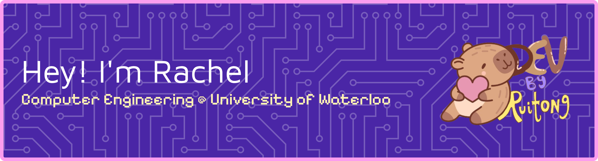

 👋 A third year Computer Engineering student @ UWaterloo who likes computer vision, software development and ux design.  
 
 🌱 7x hackathon winner specialize in HCI, computer vision, and AI/ML-integrated web and iOS application
 
 📌 I hope to gain experience through my personal projects and apply my creativity and technical skills to create apps that will brighten your day 
 
 💞️ I’m looking to collaborate on future projects/hackathons!
 
 📫 Connect with me on LinkedIn!

<!--
rachruby/rachruby is a ✨ special ✨ repository because its `README.md` (this file) appears on your GitHub profile.
You can click the Preview link to take a look at your changes.

-->
